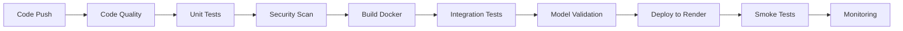

# 🚀 Deployment Guide - Credit Scoring ML API

## Table of Contents
1. [Overview](#overview)
2. [Docker Deployment](#docker-deployment)
3. [Render Deployment](#render-deployment)
4. [CI/CD Pipeline](#cicd-pipeline)
5. [Monitoring & Drift Detection](#monitoring--drift-detection)
6. [Troubleshooting](#troubleshooting)

---

## Overview

This guide covers deploying the Credit Scoring ML API using:
- **Docker**: Containerization for consistent environments
- **Render**: Cloud platform for production deployment
- **GitHub Actions**: Automated CI/CD pipeline
- **Prometheus & Grafana**: Real-time monitoring
- **MLflow**: Experiment tracking

---

## Docker Deployment

### Local Development with Docker

#### 1. Build Docker Image

```bash
cd ml-backend
docker build -t credit-scoring-ml-api .
```

#### 2. Run Container

```bash
docker run -d \
  -p 8000:8000 \
  --name ml-api \
  -e ENVIRONMENT=development \
  credit-scoring-ml-api
```

#### 3. Verify Deployment

```bash
# Health check
curl http://localhost:8000/health

# API documentation
open http://localhost:8000/docs
```

### Production with Docker Compose

#### 1. Start All Services

```bash
docker compose
 up -d
```

This starts:
- **ML API** (port 8000)
- **MLflow** (port 5000)
- **Prometheus** (port 9090)
- **Grafana** (port 3001)

#### 2. Access Services

```bash
# ML API
http://localhost:8000

# MLflow UI
http://localhost:5000

# Prometheus
http://localhost:9090

# Grafana
http://localhost:3001
# Default credentials: admin/admin
```

#### 3. Stop Services

```bash
docker compose
 down
```

#### 4. Clean Up (with volumes)

```bash
docker compose
 down -v
```

---

## Render Deployment

### Prerequisites

1. **Render Account**: Sign up at [render.com](https://render.com)
2. **GitHub Repository**: Push code to GitHub
3. **Render API Key**: Get from Render Dashboard → Account Settings

### Deployment Steps

#### Option 1: Using Render Blueprint (Recommended)

1. **Connect Repository**
   - Go to Render Dashboard
   - Click "New" → "Blueprint"
   - Connect your GitHub repository
   - Render will automatically detect `render.yaml`

2. **Configure Environment**
   - Review auto-detected services
   - Add environment variables if needed
   - Set up persistent disks

3. **Deploy**
   - Click "Apply"
   - Wait for deployment (3-5 minutes)

#### Option 2: Manual Deployment

1. **Create Web Service**
   ```bash
   # In Render Dashboard
   - New → Web Service
   - Connect Repository
   - Environment: Docker
   - Branch: main
   - Dockerfile Path: ml-backend/Dockerfile
   ```

2. **Configure Service**
   ```yaml
   Name: credit-scoring-ml-api
   Region: Oregon
   Plan: Standard
   Docker Context: ./ml-backend
   Docker Command: uvicorn app.main:app --host 0.0.0.0 --port 8000
   ```

3. **Add Environment Variables**
   ```bash
   ENVIRONMENT=production
   PORT=8000
   WORKERS=2
   ENABLE_CORS=true
   ```

4. **Set Up Health Checks**
   ```bash
   Health Check Path: /health
   ```

5. **Deploy**
   - Click "Create Web Service"
   - Monitor logs for deployment status

### Post-Deployment Configuration

#### 1. Get Service URL

```bash
# Your service URL will be:
https://credit-scoring-ml-api-XXXXX.onrender.com
```

#### 2. Test Deployment

```bash
# Health check
curl https://your-service-url.onrender.com/health

# Make prediction
curl -X POST https://your-service-url.onrender.com/api/predict \
  -H "Content-Type: application/json" \
  -d '{
    "features": {
      "credit_score": 720,
      "annual_income": 75000,
      "loan_amount": 25000
    }
  }'
```

#### 3. Configure Custom Domain (Optional)

```bash
# In Render Dashboard
- Your Service → Settings → Custom Domain
- Add your domain
- Update DNS records as instructed
```

---

## CI/CD Pipeline

### GitHub Actions Workflow

The CI/CD pipeline automatically:
1. ✅ Runs code quality checks
2. ✅ Executes unit tests
3. ✅ Scans for security vulnerabilities
4. ✅ Builds Docker image
5. ✅ Runs integration tests
6. ✅ Validates model performance
7. ✅ Deploys to Render
8. ✅ Runs smoke tests

### Required GitHub Secrets

Configure these in: **Repository → Settings → Secrets and Variables → Actions**

```bash
RENDER_API_KEY          # Your Render API key
RENDER_SERVICE_ID       # Service ID from Render dashboard
RENDER_SERVICE_URL      # Your deployed service URL
```

### Manual Deployment Trigger

```bash
# Go to GitHub Actions
- Actions tab
- Select "CI/CD Pipeline - ML Backend"
- Click "Run workflow"
- Select branch: main
- Click "Run workflow"
```

### Pipeline Stages



---

## Monitoring & Drift Detection

### Metrics Collection

The API exposes Prometheus metrics at `/metrics`:

```bash
# Key metrics
- http_requests_total
- prediction_duration_seconds
- model_accuracy
- drift_score
- api_errors_total
```

### Data Drift Monitoring

#### Automated Drift Detection

```python
# Drift is checked automatically every hour
# Configure in render.yaml:
DRIFT_CHECK_INTERVAL=3600  # seconds
```

#### Manual Drift Check

```bash
curl -X POST https://your-api-url/api/monitoring/drift \
  -H "Content-Type: application/json" \
  -d '{
    "reference_data": [...],
    "current_data": [...]
  }'
```

#### Drift Detection Response

```json
{
  "drift_detected": true,
  "drift_score": 0.72,
  "drifted_features": ["credit_score", "income"],
  "model_performance_change": {
    "accuracy_change": -0.08,
    "performance_degraded": true
  },
  "recommendations": [
    "⚠️ Data drift detected in 2 features",
    "❌ Model accuracy dropped by 8.0%",
    "🚨 Model retraining is critical"
  ]
}
```

### Model Drift Monitoring

#### Performance Tracking

```bash
# Access MLflow UI for experiment tracking
https://your-api-url/mlflow  # If exposed

# Or use local MLflow
docker compose
 up mlflow
open http://localhost:5000
```

#### Key Metrics Tracked

1. **Accuracy**: Target > 85%
2. **AUC-ROC**: Target > 0.85
3. **Fairness Score**: Target > 85%
4. **Prediction Latency**: Target < 200ms

### Alerting Rules

Configured in `monitoring/alerts.yml`:

```yaml
Alerts Triggered When:
- Drift Score > 0.7 for 5 minutes
- Model Accuracy < 80% for 10 minutes
- Prediction Latency > 2 seconds
- API Error Rate > 5%
- Service Down for > 1 minute
- Memory Usage > 90%
```

### Grafana Dashboards

Access at: `http://localhost:3001`

**Pre-configured Dashboards:**
1. Model Performance
2. Drift Detection
3. API Metrics
4. System Resources
5. Error Tracking

---

## Monitoring Setup

### 1. Configure Prometheus Data Source

```bash
# In Grafana
Configuration → Data Sources → Add Prometheus
URL: http://prometheus:9090
```

### 2. Import Dashboards

```bash
# Download dashboard JSON
# Dashboards → Import → Upload JSON file
# Or use dashboard ID from grafana.com
```

### 3. Set Up Alerts

```bash
# Configure notification channels
Alerting → Notification Channels
- Email
- Slack
- PagerDuty
- Webhooks
```

---

## Troubleshooting

### Common Issues

#### 1. Container Won't Start

```bash
# Check logs
docker logs ml-api

# Common fixes
- Ensure port 8000 is available
- Check environment variables
- Verify dependencies in requirements.txt
```

#### 2. Health Check Failing

```bash
# Debug health endpoint
curl -v http://localhost:8000/health

# Check dependencies
- MLflow connection
- Model files loaded
- Database connectivity
```

#### 3. High Memory Usage

```bash
# Monitor resource usage
docker stats ml-api

# Solutions
- Reduce model size
- Implement model quantization
- Increase container memory limit
```

#### 4. Drift Not Detected

```bash
# Verify drift detection is enabled
DRIFT_DETECTION_ENABLED=true

# Check reference data
- Ensure reference data is loaded
- Verify data format matches
```

#### 5. Render Deployment Fails

```bash
# Common causes
- Build timeout: Increase build time in Render settings
- Memory limit: Upgrade to larger plan
- Missing environment variables

# Check Render logs
- Dashboard → Your Service → Logs
```

### Performance Optimization

#### 1. Model Loading

```python
# Use model caching
- Load model once at startup
- Store in memory for fast predictions
```

#### 2. Request Batching

```python
# Batch predictions when possible
- Reduces overhead
- Better GPU utilization
```

#### 3. Database Connection Pooling

```python
# Use connection pools
- Prevents connection exhaustion
- Faster query execution
```

---

## Production Checklist

### Before Deployment

- [ ] All tests passing
- [ ] Security scan completed
- [ ] Environment variables configured
- [ ] Health checks working
- [ ] Monitoring setup complete
- [ ] Backup strategy defined
- [ ] Rollback plan documented

### After Deployment

- [ ] Health check verified
- [ ] Smoke tests passed
- [ ] Metrics collecting properly
- [ ] Alerts configured
- [ ] Documentation updated
- [ ] Team notified
- [ ] Monitoring first 24 hours

---

## Support & Resources

### Documentation
- [FastAPI Docs](https://fastapi.tiangolo.com/)
- [Render Docs](https://render.com/docs)
- [Docker Docs](https://docs.docker.com/)
- [Prometheus Docs](https://prometheus.io/docs/)

### Monitoring Tools
- **MLflow**: Experiment tracking
- **Prometheus**: Metrics collection
- **Grafana**: Visualization
- **Sentry**: Error tracking

### Community
- GitHub Issues
- Stack Overflow
- Render Community Forum

---

## Next Steps

1. **Scale**: Configure auto-scaling in Render
2. **Optimize**: Profile and optimize model inference
3. **Secure**: Add authentication and rate limiting
4. **Enhance**: Add more monitoring metrics
5. **Automate**: Set up automated retraining pipeline

---

**Deployment Status**: ✅ Production Ready

For questions or issues, please create a GitHub issue or contact the development team.
